# Table of Contents
- [Steps to install my extension for the Chrome browser](#Steps-to-publish-my-extension-for-the-Chrome-browser)
- [Publish from Chrome Web Store](#publish-from-chrome-web-store)
  - [Public](#public)
  - [Unlisted](#unlisted)
  - [Private](#private)
  - [Group publishing](#group-publishing)
  - [Manage the extension](#manage-the-extension)
- [Publish from GitHub](#publish-from-github)
  - [GitHub Workflow](#github-workflow)
  - [Generate Google API token](#generate-google-api-token)
  - [Upload to Chrome Web Store](#upload-to-chrome-web-store)
- [Steps to publish my extension ](#steps-to-install-my-extension)
  - [Chrome Browser](#chrom-browser)
  - [Firefox Browser](#firefox-browser)
  - [Opera Browser](#opera-browser)
  - [Enternet Explorer Browser](#enternet-explorer-browser)


# Steps to publish my extension for the Chrome browser


First thing first I have to publish my extension for people to be able to install it and use it, and there is two ways for that.

## Publish from Chrome Web Store

To publish in the Chrome Web Store there are a few options for the visibility of my extension and few steps to follow

### Public
Everyone can see it and install it from the Chrome Web Store

### Unlisted
Not visible in Chrome Web Store but any user with the link to the extension can see and install it 

### Private
None but users in your domain with the link can see and install it

### Group publishing
Available only if you pay a one-time developer signup fee

### Manage the extension
You can manage setting policies updates ... to your extension as an admin in the google admin console

## Publish from GitHub

A better approach as a developer to publish your extension to Chrome Web Store is using GitHub directly, so whenever you update your code and make new versions of the extension the process of publishing it to Chrome Web Store will be automated
to do so you can follow this step 

### GitHub Workflow
To create an Overflow for our project we need two steps

1. add a build action in your project folder that by creating a YAML file containing necessary set ups for building your project, in our case node.js 
here is an example. 

``` YAML
name: 'Build Chrome extension'
runs:
  using: "composite"
  steps:
    - name: Setup Node.js
      uses: actions/setup-node@v3
      with:
        node-version: 18

    - name: Install packages
      run: npm ci
      shell: bash

    - name: Build extension
      run: npm run build --if-present
      shell: bash

    - name: Pack extension
      working-directory: out
      run: zip -r extension-${{ github.event.pull_request.head.sha }}.zip *
      shell: bash

    - name: Upload extension archive
      uses: actions/upload-artifact@v3
      with:
        name: extension-${{ github.sha }}
        path: out/extension-${{ github.event.pull_request.head.sha }}.zip 
```

2. create a build workflow using the build action
here is an example 

``` YAML
name: Build

on:
  push:
    branches: [ main ]
  pull_request:
    branches: [ main ]

jobs:
  build-extension:
    runs-on: ubuntu-latest
    steps:
      - uses: actions/checkout@v3
      - uses: ./.github/actions/buildextension
```

### Generate Google API token
Now all you need before uploading the extension is to make sure to generate the Google API token and store it in GitHub secrets, so that the workflow can upload the zip file produced by the build action into Chrome Web Store directly without the need to do it manually each time
to do so 
reference "https://developer.chrome.com/docs/webstore/using-api"

1. Enable the Chrome Web Store API
Go to google cloud console, create a new project or select an existing one in the google cloud console and type in "Chrome Web Store API" and enable it
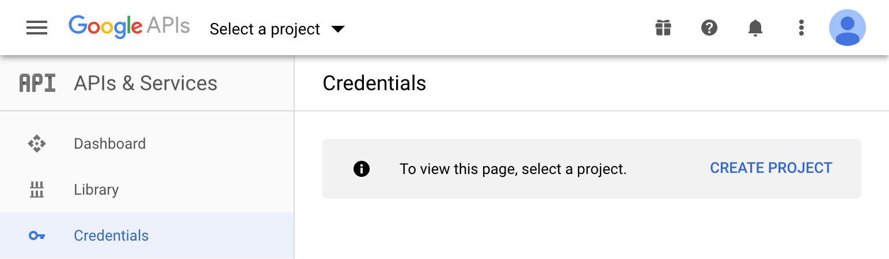

2. Configure the OAuth consent screen
Go to OAuth consent screen -> External -> create, fill only application name and required email fields then save
On third screen add your own email 
This lets you immediately use the project without needing to go through an approval process.
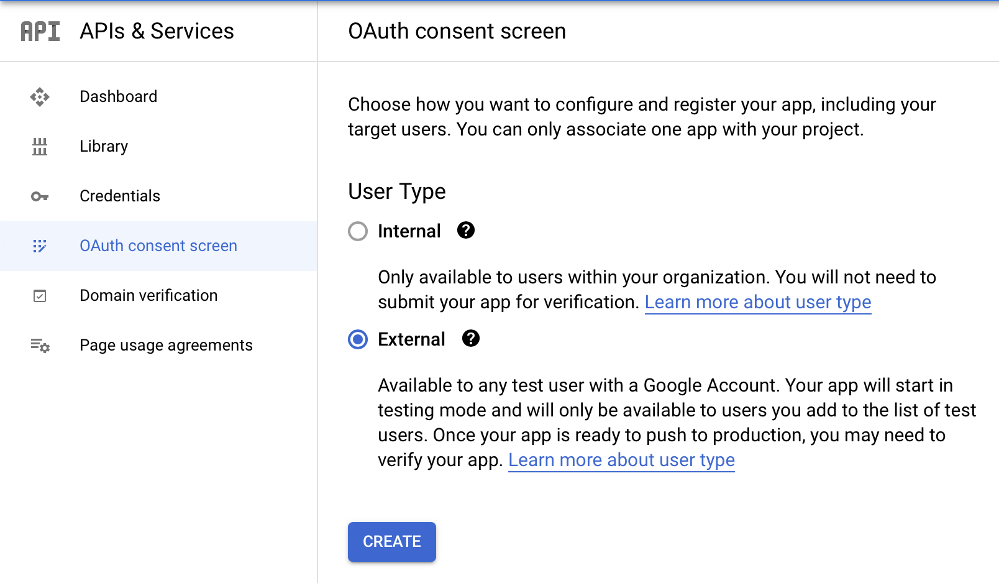
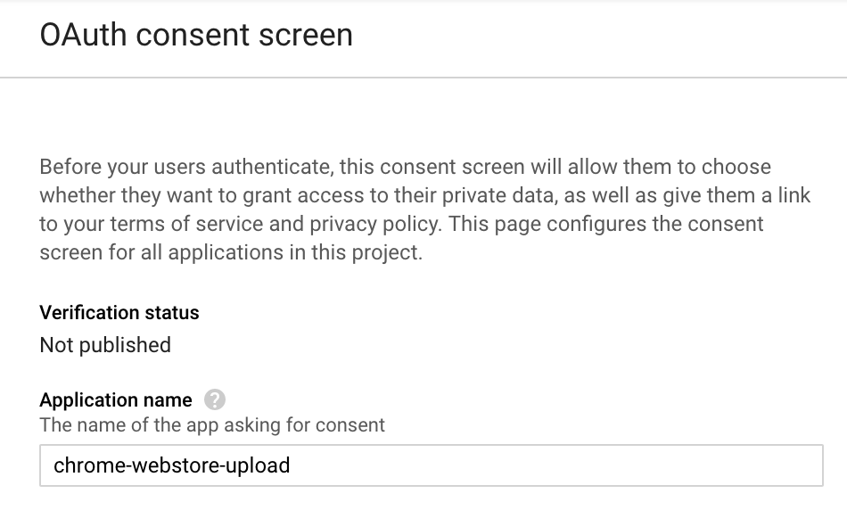
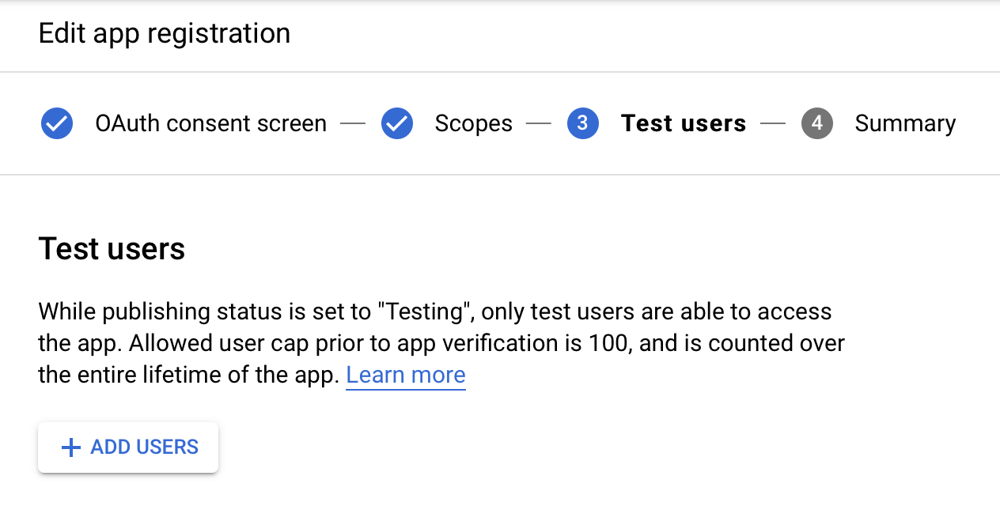


3. Create an OAuth Client
Go to Credentials -> OAuth client ID and choose Chrome Extension for Application type name its Chrome Webstore Upload for example then save the given client id and client secret and store them in your GitHub secrets 
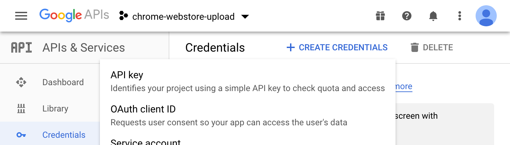
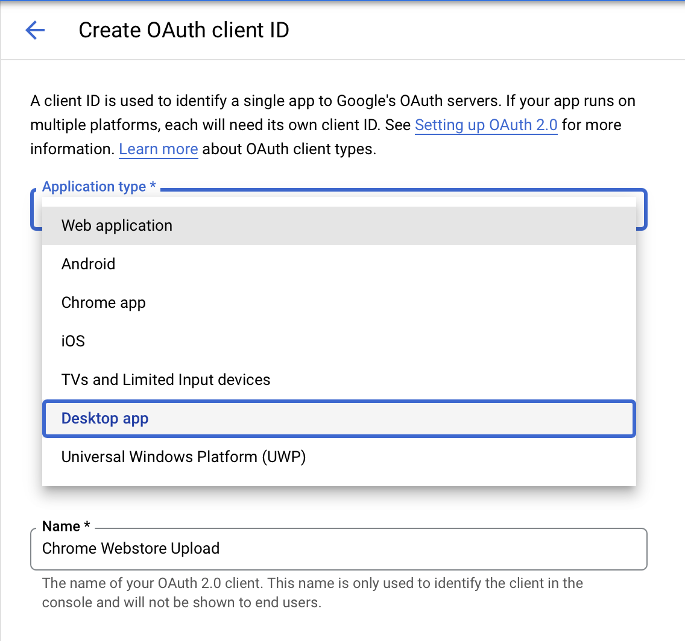
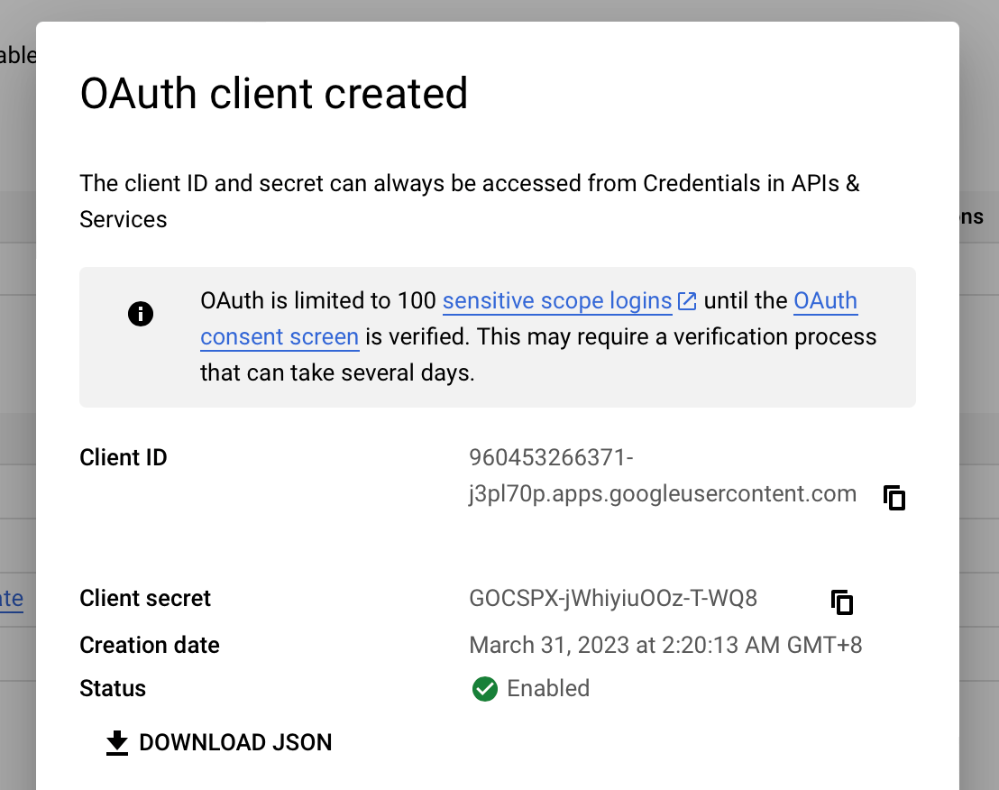

4. Publish the app
Visit https://console.cloud.google.com/apis/credentials/consent and click publish app and confirm
run "npx chrome-webstore-upload-keys" or "bunx chrome-webstore-upload-keys" to generate the required refresh token
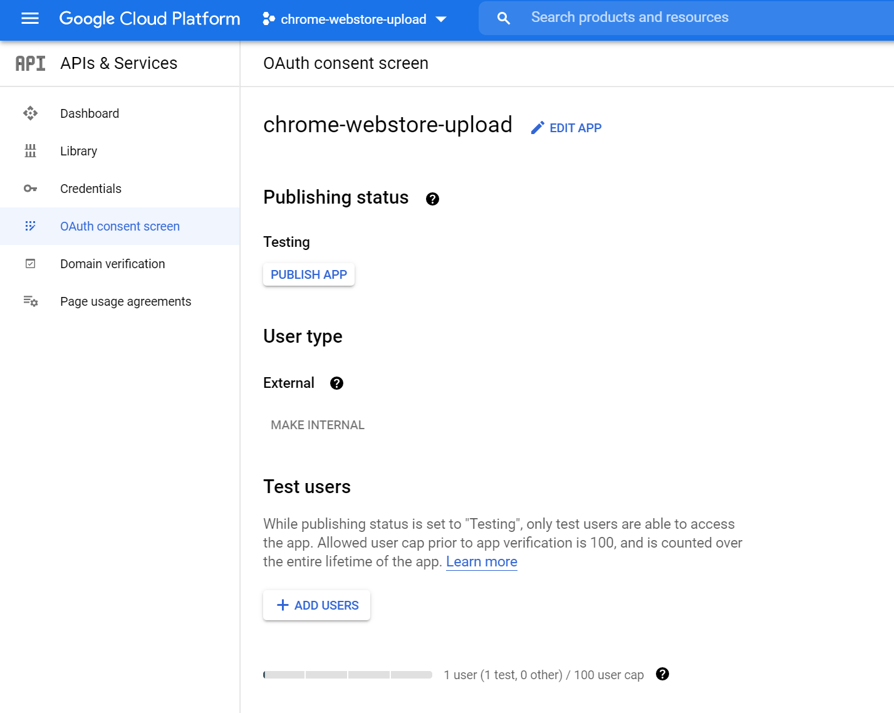
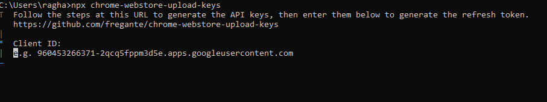
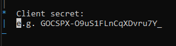
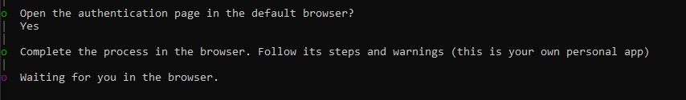

### Upload to Chrome Web Store
now that you have the necessary client id, secret and refresh token, we will add the last workflow, upload workflow
here is an example 

``` YAML
name: Upload to Web Store
on:
  push:
    tags:
      - '*'
jobs:
  build-extension:
    runs-on: ubuntu-latest
    steps:
      - uses: actions/checkout@v3
      - uses: ./.github/actions/buildextension

  upload-extension:
    runs-on: ubuntu-latest
    needs: build-extension
    steps:
      - name: Download extension archive
        uses: actions/download-artifact@v3
        with:
          name: extension-${{ github.sha }}

      - name: Upload to webstore
        uses: ExtensionNinja/extension-publish@main
        with:
          action: upload
          extensionID: INSERT_YOUR_EXTENSION_ID
          clientID: ${{ secrets.GOOGLE_CLIENT_ID }}
          clientSecret: ${{ secrets.GOOGLE_CLIENT_SECRET }}
          clientRefreshToken: ${{ secrets.GOOGLE_REFRESH_TOKEN }}
          extensionFile: extension-${{ github.event.pull_request.head.sha }}.zip
```

now with your last commit the workflow will work on uploading your extension into the Chrome Web Store
you can check it yourself if you want in the Chrome Web Store, you will find a new version

# Steps to install my extension


## Chrome Browser
open chrome browser, and go the extensions -> Chrome Web Store page
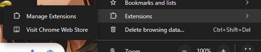
search for desired extension and click install

## Firefox Browser
open firefox browser, and go more tools -> Extensions for developers
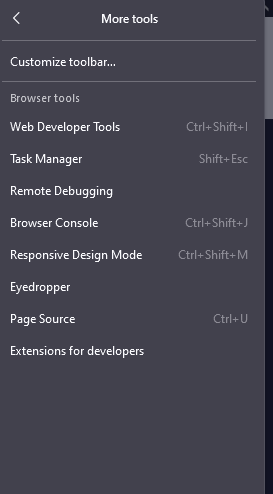
search for desired extension and click install

## Opera Browser
open opera browser, and go extensions
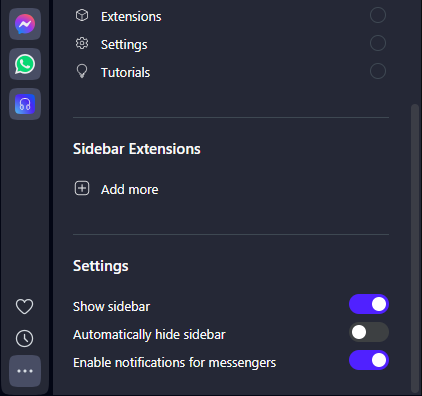
search for desired extension and click install or click Get more extensions

## Enternet Explorer Browser
open opera browser, and go to [edge://extensions/](https://microsoftedge.microsoft.com/addons/Microsoft-Edge-Extensions-Home?hl=en-US)

search for desired extension and click install or click Get more extensions