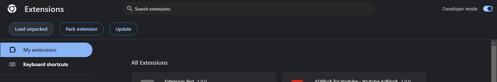
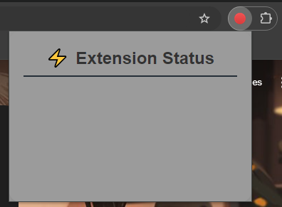
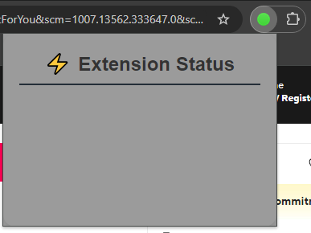
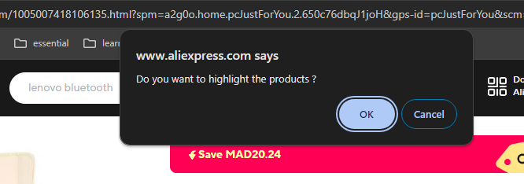
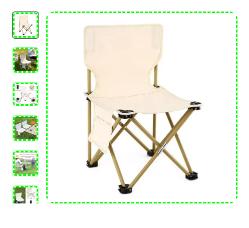
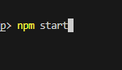

## 1. Manual testing
1. Open your browser and go to the Extensions page

2. Enable "Developer mode".
3. Click "Load unpacked" (Chrome) and select your extension's project folder.

4. Click on the extension icon to open the popup and test its functionality.

5. Visit a website to check if it's within the listed websites.

## 2. test using puppeteer

## Run : npm start, and the test will start
